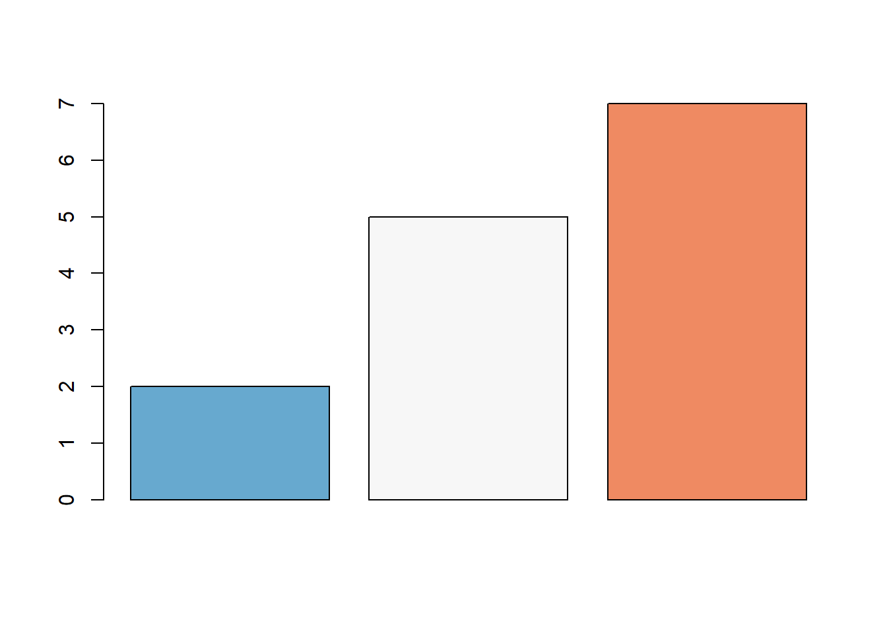
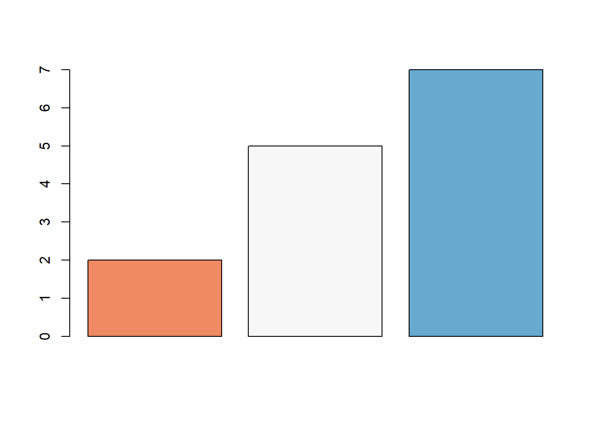

```{r setup, include=FALSE}
knitr::opts_chunk$set(collapse = TRUE,fig.align='center',results='hold',fig.show='hide',fig.path='images/')
```

配色在绘图中是比较高阶的内容，合理美观的搭配，不仅可以提高图的可读性、突出重要信息的特点，而且可以让人耳目一新。<!--more-->

## RColorBrewer 包

调色板有3种类型：连续型调色板、离散型调色板和定性调色板。

**连续型调色板**，适用于从低到高（渐变）的有序数据。
Blues, BuGn, BuPu, GnBu, Greens, Greys, Oranges, OrRd, PuBu, PuBuGn, PuRd, Purples, RdPu, Reds, YlGn, YlGnBu YlOrBr, YlOrRd

**离散型调色板**，同时强调中端临界值和数据范围两端的极端值。

BrBG, PiYG, PRGn, PuOr, RdBu, RdGy, RdYlBu, RdYlGn, Spectral

**定性调色板**，适用于名义型或分类型变量。 它们并不代表组之间的大小差异。
Accent, Dark2, Paired, Pastel1, Pastel2, Set1, Set2, Set3

>作者：谢俊飞
链接：https://www.jianshu.com/p/21971df8e2e4
来源：简书`

```{r, RcolorBrewer,fig.height=10}
library(RColorBrewer)
display.brewer.all()
# 通过指定名字来查看调色板
display.brewer.pal()
```


```{r, RcolorBrewer2}
#rm(list = ls())
#install.packages("RColorBrewer")
library(RColorBrewer)
# RColorBrewer绘制条形图
barplot(c(2,5,7), col=rev(brewer.pal(n = 3, name = "RdBu")))###########颜色按倒序排列
barplot(c(2,5,7), col=brewer.pal(n = 3, name = "RdBu"))
```




##  创建n个连续颜色的向量

可以使用函数rainbow(n), heat.colors(n), terrain.colors(n), topo.colors(n)和cm.colors(n)生成n个连续颜色的向量
```{r continuous}
#Create a vector of n contiguous colors
# Use rainbow colors
barplot(1:5, col=rainbow(5))
# Use heat.colors
barplot(1:5, col=heat.colors(5))
# Use terrain.colors
barplot(1:5, col=terrain.colors(5))
# Use topo.colors
barplot(1:5, col=topo.colors(5))
# Use cm.colors
barplot(1:5, col=cm.colors(5))
```